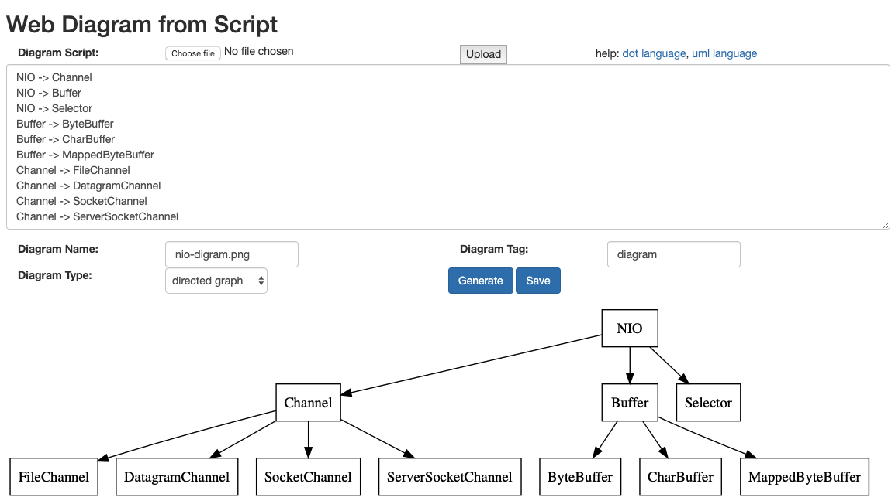
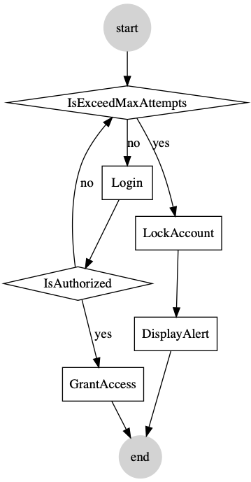
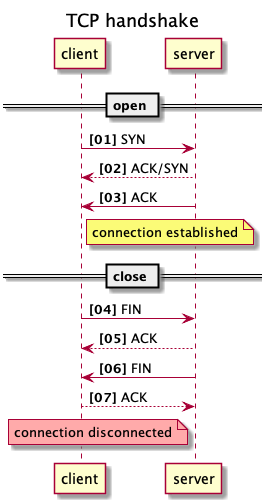
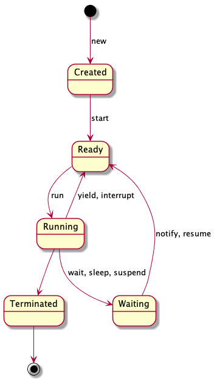

# Introduction

This is an experimental web project when I'm learning flask by a flask book wrote by Miguel Grinberg.

The main functions of this project is to draw diagrams on web:

1. Flow chart
2. Mindmap
3. UML diagram: class diagram, sequence diagram, state diagram, etc.

# Examples
There are two methods to generate diagram 

1) Web gui
2) Command line

## Mindmap
write a script as below

```
NIO -> Channel
NIO -> Buffer
NIO -> Selector
Buffer -> ByteBuffer
Buffer -> CharBuffer
Buffer -> MappedByteBuffer
Channel -> FileChannel
Channel -> DatagramChannel
Channel -> SocketChannel
Channel -> ServerSocketChannel

```

then generate the following diagram




## Flow Chart
* Login flow chart

write a script as below

```
start -> IsExceedMaxAttempts
IsExceedMaxAttempts -> Login[cond=no]
IsExceedMaxAttempts -> LockAccount[cond=yes]
LockAccount -> DisplayAlert
Login -> IsAuthorized
IsAuthorized -> GrantAccess[cond="yes"]
IsAuthorized -> IsExceedMaxAttempts[cond="no"]
GrantAccess -> end
DisplayAlert -> end
```

```shell script
fab draw:./examples/login-flowchart.txt,./examples/login-flowchart.png
```

then generate the following chart



## Sequence diagram

* tcp handshake

write a script as below

```
title TCP handshake
participant client
participant server
autonumber "<b>[00]"

== open ==
note right of server: LISTEN
client -> server: SYN
note left of client: SYN_SENT
note right of server: SYN_RCVD
server --> client: ACK/SYN
server -> client: ACK
note over client, server: ESTABILISHED

== close ==

client -> server: FIN
note left of client: FIN_WAIT_1
note right of server: CLOSE_WAIT
server --> client: ACK
note left of client: FIN_WAIT_2
server -> client: FIN
note right of server: LAST_ACK
note left of client: TIME_WAIT
client --> server: ACK
note right of server #FFAAAA: CLOSED

```

then generate the following diagram




## State diagram

```

[*] --> Created: new
Created --> Ready: start
Ready --> Running: run
Running --> Ready: yield, interrupt
Running --> Waiting: wait, sleep, suspend
Waiting --> Ready: notify, resume
Running --> Terminated
Terminated --> [*]

```



# Quick start
## 1) prepare environment

```

brew install libev
brew install python3

virtualenv -p python3 venv
source venv/bin/activate
pip install -r requirements.txt
source setenv.sh
```

## 2) create your environment file

```
# vi .env

FLASK_APP=app

MAIL_SERVER = smtp.163.com
MAIL_PORT = 465
MAIL_USE_SSL = true
MAIL_USE_TLS = false
MAIL_USERNAME = ***@163.com
MAIL_PASSWORD = ******

ADMIN_DEFAULT_EMAIL=***@163.com
ADMIN_DEFAULT_PASSWORD = ********

```

## 3) create the db schema and initial data

```
fab init_db
```

## 4) start debug server

```shell script
run server
```

## 5) login 
open http://localhost:5000 and login with the default administrar account as above

# FAQ
## how to start app?

```shell script
source ./venv/bin/activate
export FLASK_DEBUG=1
export FLASK_APP=app.py
flask run --host=0.0.0.0 --port=8000 &
```
## how to check schema

```shell script
sqlite3 web-diagram-dev.db
sqlite> .schema
sqlite> .quit 
```
## how to run test

```shell script
flask test
```

## how to run embed shell

```
flask shell
>>> user = User.query.all()

```
